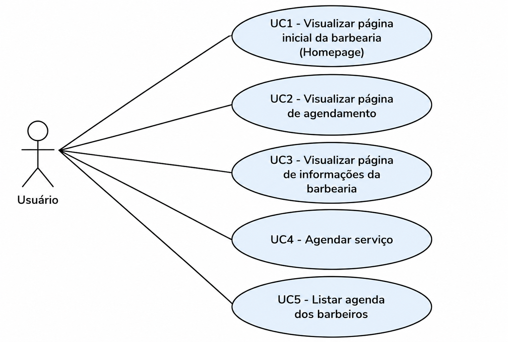
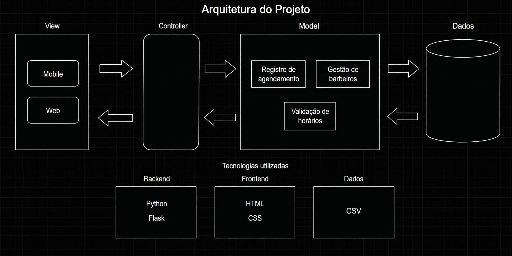

# 💈 BarberTime

> Gerenciamento de agendamentos inteligente, preciso e sem colisões de horários.

O **BarberTime** é uma plataforma web desenvolvida para modernizar e automatizar o processo de agendamento em barbearias. O principal objetivo do projeto é evitar conflitos de horários entre clientes e barbeiros, garantindo uma agenda organizada e confiável.

A aplicação foi desenvolvida utilizando **Python**, **Flask**, **HTML** e **CSS**, com persistência de dados em arquivos **CSV**, sem utilização de Banco de Dados e JavaScript.

---

# 📖 Sobre o Projeto

O BarberTime foi desenvolvido para modernizar o processo de agendamento em barbearias, substituindo o controle manual realizado pelo responsável pelo estabelecimento. Com isso, o sistema reduz erros humanos, evita esquecimentos, elimina conflitos de horários e centraliza todas as informações da agenda em um único lugar, tornando o gerenciamento mais rápido, organizado e confiável.

Sempre que um cliente realiza um agendamento, o sistema calcula automaticamente o intervalo ocupado com base na duração do serviço escolhido. Caso já exista outro atendimento no mesmo período para o barbeiro selecionado, a nova solicitação é bloqueada e o usuário recebe uma mensagem informando o conflito, garantindo uma agenda consistente e sem sobreposições.

Além disso, a aplicação possui validações para impedir datas passadas, horários já encerrados no dia atual e entradas inválidas de datas.

---

# ✨ Funcionalidades

## 📅 Agendamento Inteligente

- Cálculo automático da duração de cada serviço utilizando `datetime.timedelta`;
- Bloqueio de conflitos entre horários;
- Impede agendamentos em datas passadas;
- Impede selecionar horários que já passaram no dia atual;
- Validação segura das datas antes da conversão para evitar erros.

## 👥 Dashboard

- Visualização dos agendamentos cadastrados;
- Exibição organizada dos horários;
- Atualização automática após novos agendamentos.

## 💾 Persistência

- Armazenamento dos dados em arquivo CSV;
- Leitura e escrita;
- Estrutura simples e de fácil manutenção.

## 🔔 Feedback ao usuário

- Mensagens de sucesso ao concluir um agendamento;
- Avisos claros quando existir conflito de horários;
- Exibição do intervalo ocupado que gerou o bloqueio.

---

# 🚀 Tecnologias Utilizadas

| Tecnologia | Finalidade |
|------------|------------|
| 🐍 Python 3.14 | Lógica de negócio |
| 🌶️ Flask | Framework Web |
| 📑 Jinja2 | Templates HTML |
| 🎨 HTML5 | Estrutura das páginas |
| 🎨 CSS3 | Estilização |
| 📂 CSV | Persistência dos dados |
| 🛠️ Git | Controle de versão |
| 🐙 GitHub | Hospedagem do projeto |

---

# 📁 Estrutura do Projeto

```text
barbertime/
│
├── docs/
│   └── images/
│       ├── diagrama-casos-de-uso.png
│       └── arquitetura-projeto.png
├── 📁 data/
│   └── 📄 agendamentos.csv          # Persistência dos agendamentos
│
├── 📁 routes/
│   ├── 🐍 __init__.py               # Inicialização do pacote de rotas
│   ├── 🐍 contact.py                # Rotas da página de contato
│   ├── 🐍 dashboard.py              # Rotas do painel administrativo
│   ├── 🐍 main.py                   # Rotas da página inicial
│   ├── 🐍 scheduling.py             # Rotas de agendamento
│   └── 🐍 scheduling_manager.py    
│
├── 📁 static/
│   ├── 📁 css/
│   │   ├── 🎨 agendamento.css
│   │   ├── 🎨 base.css
│   │   ├── 🎨 contato.css
│   │   ├── 🎨 dashboard.css
│   │   ├── 🎨 homepage.css
│   │   └── 🎨 style.css
│   │
│   └── 📁 images/                   # Imagens da aplicação
│
├── 📁 templates/
│   ├── 📄 agendamento.html
│   ├── 📄 base.html
│   ├── 📄 contato.html
│   ├── 📄 dashboard.html
│   └── 📄 index.html
│
├── 📁 venv/                         # Ambiente virtual (não versionado)
│
├── 📄 .gitignore
├── 📄 app.py                        # Arquivo principal da aplicação Flask
├── 📄 requirements.txt              # Dependências do projeto
└── 📄 README.md
```

---

# 📋 Diagrama de Casos de Uso

O diagrama abaixo apresenta as principais funcionalidades disponibilizadas ao usuário do sistema e a interação entre o ator e cada caso de uso.

<p align="center">
    
</p>

---

# 🏗️ Arquitetura do Projeto

A arquitetura da aplicação foi organizada seguindo a estrutura MVC.

<p align="center">
    
</p>

# ⚙️ Instalação

## Pré-requisitos

- Python 3.14 ou superior
- Git
- pip

---

## 1. Clone o repositório

```bash
git clone https://github.com/gustamoraiss/barbertime.git

cd barbertime
```

---

## 2. Crie um ambiente virtual

### Windows

```bash
python -m venv venv

.\venv\Scripts\activate
```

### Linux / macOS

```bash
python3 -m venv venv

source venv/bin/activate
```

---

## 3. Instale as dependências

```bash
pip install -r requirements.txt
```

---

## 4. (Opcional) Configure a SECRET_KEY

Crie um arquivo `.env` na raiz do projeto:

```env
SECRET_KEY=sua_chave_secreta
```

---

## 5. Execute a aplicação

```bash
python app.py
```

Acesse no navegador:

```
http://127.0.0.1:5000
```

---

# 💡 Como funciona o sistema

1. Seleciona o serviço desejado;
2. Informa a data e o horário;
3. O usuário escolhe um barbeiro;
4. Seleciona um horário;
5. Preenche campo com nome e contato;
6. O sistema calcula automaticamente o tempo de duração do serviço;
7. É realizada uma verificação para identificar conflitos na agenda do barbeiro;
8. Caso exista sobreposição, o agendamento é recusado;
9. Caso contrário, o atendimento é salvo e exibido no dashboard.

---

# 🎯 Objetivos do Projeto

Este projeto foi desenvolvido com o objetivo de praticar:

- Desenvolvimento Web com Flask;
- Organização utilizando Blueprints;
- Manipulação de arquivos CSV;
- Validação de formulários;
- Regras de negócio utilizando `datetime`;
- Estruturação de templates com Jinja2;
- Controle de versão utilizando Git e GitHub.

---

# 📄 Licença

Este projeto está licenciado sob a Licença MIT.

---

# 👨‍💻 Autor

Desenvolvido por **Gustavo Morais, Marcos Moura e Gabriel Leite**.

Caso tenha sugestões ou queira contribuir, fique à vontade para abrir uma Issue ou enviar um Pull Request.

---

# 💈 BarberTime

**Organização, precisão e estilo para a sua agenda.**